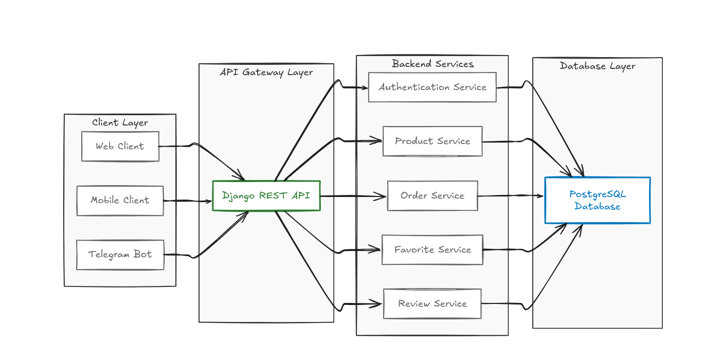
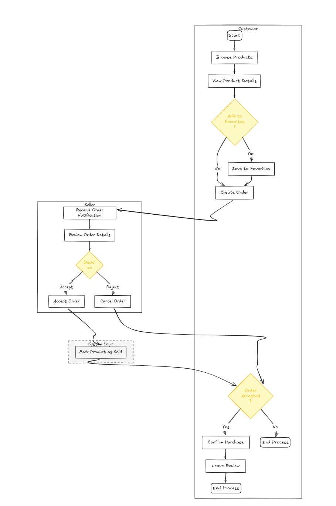
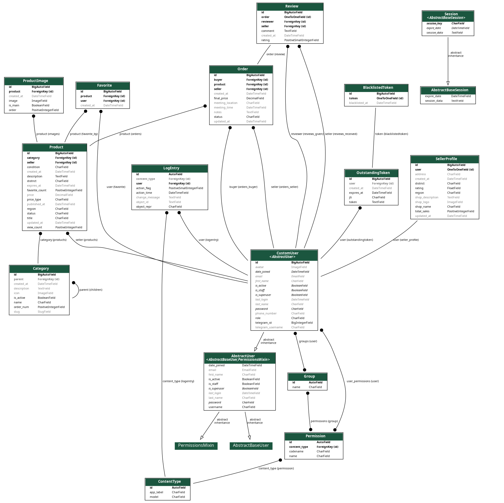
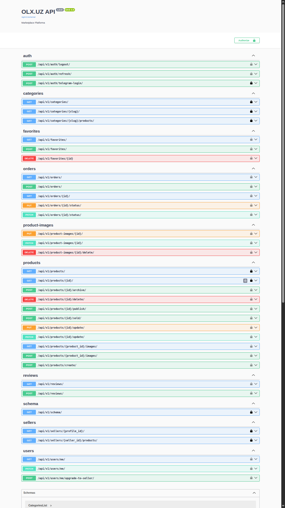

# Technical Specification (TZ)

## OLX.UZ Marketplace Backend

---

## ## 1. Project Overview

## 1. Project Overview



Ushbu loyiha **OLX’ga o‘xshash soddalashtirilgan marketplace backend tizimini** amalga oshirishni maqsad qiladi. Tizim orqali foydalanuvchilar mahsulotlarni sotishi va sotib olishi mumkin.

Platforma **REST API** orqali ishlaydi va asosiy marketplace funksiyalarini ta’minlaydi. Backend qismi **Django** va **Django REST Framework** yordamida monolit arxitektura asosida ishlab chiqiladi. Asosiy maqsad — **maintainable, scalable va aniq strukturalangan backend tizim yaratish**.

### Asosiy funksiyalar

Tizim quyidagi imkoniyatlarni taqdim etadi:

* **Mahsulotlarni ko‘rish (browse products)** – foydalanuvchilar platformadagi e’lonlarni ko‘rishlari mumkin
* **Sevimlilar ro‘yxati (favorites)** – foydalanuvchilar mahsulotlarni sevimlilar ro‘yxatiga qo‘shishlari mumkin
* **Buyurtma berish (orders)** – mijozlar mahsulotlarni sotib olish uchun buyurtma berishlari mumkin
* **Sharh qoldirish (reviews)** – mijozlar sotib olingan mahsulotlar uchun sharh yozishlari mumkin
* **Seller profilini boshqarish** – sotuvchilar o‘z mahsulotlarini va buyurtmalarini boshqarishlari mumkin

### Foydalanuvchi rollari

Tizimda ikkita asosiy foydalanuvchi roli mavjud.

#### Customer

Customer — platformadan mahsulot sotib oladigan foydalanuvchi.

Customer quyidagi amallarni bajarishi mumkin:

* mahsulotlarni ko‘rish
* mahsulotlarga buyurtma berish
* sotib olingan mahsulotlar uchun sharh qoldirish

#### Seller

Seller — platformada mahsulot joylaydigan va sotadigan foydalanuvchi.

Seller quyidagi amallarni bajarishi mumkin:

* mahsulot e’lonlarini yaratish
* mahsulot e’lonlarini yangilash
* mahsulot e’lonlarini o‘chirish
* o‘z mahsulotlariga kelgan buyurtmalarni boshqarish

### Loyiha chegarasi

Ushbu loyiha doirasida **admin panel funksionalligi ko‘zda tutilmagan**. Tizim faqat **customer va seller o‘rtasidagi marketplace jarayonlarini** amalga oshirishga qaratilgan.


## 2. Technology Stack

### Backend
- **Python** – asosiy dasturlash tili  
- **Django 4.x** – backend framework, monolit arxitektura asosida biznes logikani boshqarish  
- **Django REST Framework (DRF)** – RESTful API yaratish, serialization, authentication, permissions va view layer

### Database
- **PostgreSQL** – relational database management system  
  - ACID compliance
  - advanced indexing
  - JSONB qo‘llab-quvvatlashi
  - katta hajmdagi ma’lumotlar bilan barqaror ishlash

### Authentication
- **Simple JWT**
  - JSON Web Token asosida stateless authentication
  - access token va refresh token mexanizmi
  - DRF bilan native integratsiya

### Other Tools
- **python-telegram-bot**
  - Telegram bot yaratish
  - marketplace bilan integratsiya (masalan: yangi e’lonlar, notifications)

- **drf-spectacular**
  - OpenAPI 3 schema generatsiyasi
  - Swagger / Redoc documentation
  - API endpointlarni avtomatik hujjatlashtirish

### Version Control
- **Git**
  - source code versioning
  - branch strategy (feature / develop / main)
  - collaboration workflow

## 3. Core Features



### User System

Foydalanuvchilar tizimga **Telegram orqali autentifikatsiya** qilish orqali kirishadi. Login jarayonida foydalanuvchi Telegram orqali tasdiqlanadi va tizim tomonidan **JWT (JSON Web Token)** beriladi. Ushbu token keyingi API so‘rovlarida foydalanuvchini identifikatsiya qilish uchun ishlatiladi.

Authentication mexanizmi quyidagi komponentlardan iborat:

* **Telegram Login** – foydalanuvchini Telegram hisob orqali autentifikatsiya qilish
* **JWT Authentication** – API uchun stateless authentication mexanizmi
* **Access Token / Refresh Token** – xavfsiz va uzluksiz session boshqaruvi

Tizimda ikki xil foydalanuvchi roli mavjud:

* **customer** – mahsulotlarni ko‘rish, buyurtma berish va sharh qoldirish imkoniyatiga ega
* **seller** – mahsulotlarni boshqarish va buyurtmalarni qayta ishlash imkoniyatiga ega

---

### Seller System

Seller — marketplace’da mahsulot sotadigan foydalanuvchi. Seller uchun alohida **seller profile** mavjud bo‘ladi.

Seller quyidagi imkoniyatlarga ega:

* **Seller profil yaratish** – sotuvchi sifatida platformada faoliyat boshlash
* **Mahsulotlarni boshqarish** – mahsulot yaratish, yangilash va o‘chirish
* **Buyurtmalarni ko‘rish** – o‘z mahsulotlari bo‘yicha kelgan buyurtmalarni ko‘rish
* **Buyurtma statusini yangilash** – buyurtma jarayonini boshqarish
* **Savdo statistikalarini ko‘rish** – sotilgan mahsulotlar bo‘yicha statistik ma’lumotlarni kuzatish

Bu modul sotuvchilarga o‘z biznes jarayonlarini marketplace ichida boshqarish imkonini beradi.

---

### Product System

Mahsulotlar marketplace’ning asosiy domen obyekti hisoblanadi. Har bir mahsulot e’loni quyidagi atributlarga ega bo‘ladi:

* **category** – mahsulot tegishli bo‘lgan kategoriya
* **title** – mahsulot nomi
* **description** – mahsulot tavsifi
* **price** – mahsulot narxi
* **condition** – mahsulot holati (masalan: yangi, ideal, ishlatilgan)
* **images** – mahsulot rasmlari
* **location** – mahsulot joylashuvi
* **status lifecycle** – mahsulot e’lonining holati (masalan: active, sold, archived)

Mahsulot status lifecycle orqali e’lonning marketplace’dagi hayotiy sikli boshqariladi.

## 4. Additional Marketplace Features

### Favorites System

Favorites tizimi foydalanuvchilarga qiziqarli mahsulotlarni saqlab qo‘yish va keyinchalik tez topish imkonini beradi. Bu funksiya marketplace UX’ini yaxshilash uchun muhim hisoblanadi.

Foydalanuvchilar quyidagi amallarni bajarishlari mumkin:

* **Mahsulotni favorites ro‘yxatiga qo‘shish** – qiziqarli mahsulotni saqlash
* **Favorites’dan o‘chirish** – mahsulotni ro‘yxatdan olib tashlash
* **Favorites ro‘yxatini ko‘rish** – foydalanuvchining barcha saqlangan mahsulotlarini ko‘rish

Texnik jihatdan bu funksiya odatda **User–Product o‘rtasidagi many-to-many munosabat** orqali amalga oshiriladi. Har bir foydalanuvchi bir nechta mahsulotni saqlashi mumkin va har bir mahsulot bir nechta foydalanuvchining favorites ro‘yxatida bo‘lishi mumkin.

---

### Order System

Order tizimi marketplace’dagi savdo jarayonini boshqaradi. Buyurtma jarayoni buyer va seller o‘rtasidagi tranzaksiyani ifodalaydi.

Buyurtma jarayoni quyidagi bosqichlardan iborat:

1. **Buyer order yaratadi**
   Buyer mahsulotni sotib olish uchun order yaratadi.

2. **Seller buyurtmani ko‘rib chiqadi**
   Seller buyurtmani:

   * tasdiqlashi mumkin
   * kelishuv (negotiation) qilishi mumkin
   * bekor qilishi mumkin

3. **Buyer xaridni tasdiqlaydi**
   Agar buyer taklifni qabul qilsa, buyurtma yakunlanadi.

4. **Mahsulot holati o‘zgaradi**
   Buyurtma muvaffaqiyatli tugagandan so‘ng:

   * mahsulot **sold** statusiga o‘tadi

5. **Seller statistikasi yangilanadi**
   Seller profilidagi **sales counter** avtomatik ravishda oshiriladi.

Bu jarayon marketplace’da **transaction lifecycle** ni boshqarish uchun ishlatiladi.

---

### Review System

Review tizimi marketplace’da ishonch (trust) mexanizmini yaratadi. Xaridorlar muvaffaqiyatli yakunlangan buyurtmadan keyin sotuvchi haqida fikr qoldirishlari mumkin.

Review tizimi quyidagi qoidalarga ega:

* **Faqat muvaffaqiyatli orderdan keyin review qoldirish mumkin**
* **Har bir order uchun faqat bitta review yozish mumkin**
* **Rating 1 dan 5 gacha bo‘ladi**

Har safar yangi review qo‘shilganda:

* seller’ning **umumiy reytingi avtomatik qayta hisoblanadi**
* bu reyting boshqa foydalanuvchilarga seller ishonchliligini ko‘rsatadi

Seller rating odatda quyidagicha hisoblanadi:

[
seller_rating = \frac{\sum ratings}{reviews_count}
]

Bu qiymat seller profilida saqlanishi yoki dinamik tarzda agregatsiya orqali hisoblanishi mumkin.

## 4. Database Models




### User

`User` modeli tizimdagi barcha foydalanuvchilarni ifodalaydi. Autentifikatsiya **Telegram orqali** amalga oshirilgani sababli asosiy identifikator sifatida `telegram_id` ishlatiladi.

**Fields:**

* **id** – foydalanuvchining unik identifikatori
* **telegram_id** – Telegram foydalanuvchi ID’si
* **username** – foydalanuvchi username’i
* **first_name** – ism
* **last_name** – familiya
* **phone_number** – telefon raqami
* **role** – foydalanuvchi roli
* **avatar** – profil rasmi
* **is_active** – foydalanuvchi aktiv holati
* **date_joined** – ro‘yxatdan o‘tgan vaqt
* **last_login** – oxirgi kirgan vaqt

**Roles:**

* **customer** – mahsulotlarni ko‘rish va xarid qilish uchun
* **seller** – mahsulot joylash va sotish uchun

---

### SellerProfile

`SellerProfile` modeli sotuvchi haqida qo‘shimcha ma’lumotlarni saqlaydi. Bu model `User` bilan **One-to-One relationship** orqali bog‘lanadi.

**Fields:**

* **id** – profil identifikatori
* **user** – `User` modeliga bog‘lanish
* **shop_name** – do‘kon nomi
* **shop_description** – do‘kon tavsifi
* **shop_logo** – do‘kon logotipi
* **region** – viloyat
* **district** – tuman
* **address** – aniq manzil
* **rating** – sotuvchi reytingi
* **total_sales** – sotilgan mahsulotlar soni
* **created_at** – profil yaratilgan vaqt
* **updated_at** – oxirgi yangilangan vaqt

---

### Category

`Category` modeli mahsulot kategoriyalarini saqlaydi. Kategoriyalar **hierarchical structure** asosida tashkil etilgan, ya’ni kategoriya ichida sub-kategoriyalar bo‘lishi mumkin.

**Fields:**

* **id** – kategoriya identifikatori
* **name** – kategoriya nomi
* **slug** – URL uchun slug
* **parent** – ota kategoriya (self-referencing foreign key)
* **icon** – kategoriya ikonasi
* **description** – kategoriya tavsifi
* **is_active** – kategoriya aktiv yoki yo‘qligi
* **order_num** – tartiblash uchun indeks
* **created_at** – yaratilgan vaqt

Bu struktura yordamida masalan quyidagi daraxt hosil bo‘lishi mumkin:

```
Electronics
 ├── Phones
 ├── Laptops
 └── Accessories
```

Shu orqali mahsulotlarni **kategoriya bo‘yicha samarali filtr qilish va navigatsiya qilish** mumkin.

### Product

`Product` modeli marketplace’dagi e’lon qilingan mahsulotlarni ifodalaydi. Har bir mahsulot ma’lum bir **seller** tomonidan joylanadi va **category** ga tegishli bo‘ladi.

Mahsulot e’loni o‘zining **lifecycle status** holatlariga ega bo‘lib, bu e’lonning platformadagi holatini boshqaradi.

**Fields:**

* **id** – mahsulot identifikatori
* **seller** – mahsulot egasi (`User` yoki `SellerProfile` bilan bog‘lanadi)
* **category** – mahsulot kategoriyasi
* **title** – mahsulot nomi
* **description** – mahsulot tavsifi
* **condition** – mahsulot holati (yangi, ideal, ishlatilgan)
* **price** – mahsulot narxi
* **price_type** – narx turi (masalan: fixed, negotiable)
* **region** – viloyat
* **district** – tuman
* **view_count** – mahsulot ko‘rilganlar soni
* **favorite_count** – nechta foydalanuvchi favorites ga qo‘shgani
* **status** – mahsulot statusi
* **created_at** – yaratilgan vaqt
* **updated_at** – oxirgi yangilangan vaqt
* **published_at** – e’lon nashr qilingan vaqt
* **expires_at** – e’lon muddati tugash vaqti

**Product statuses:**

* **moderatsiyada** – e’lon tekshiruv jarayonida
* **aktiv** – e’lon platformada ko‘rinmoqda
* **rad etilgan** – moderatsiya tomonidan rad qilingan
* **sotilgan** – mahsulot sotilgan
* **arxivlangan** – e’lon arxivga o‘tkazilgan

---

### ProductImage

`ProductImage` modeli mahsulotga tegishli rasmlarni saqlash uchun ishlatiladi. Bir mahsulotda bir nechta rasm bo‘lishi mumkin.

**Fields:**

* **id** – rasm identifikatori
* **product** – qaysi mahsulotga tegishli ekanligi
* **image** – rasm fayli
* **order** – rasm tartibi (gallery order)
* **is_main** – asosiy rasm yoki yo‘qligi
* **created_at** – rasm yuklangan vaqt

Bu model orqali **product gallery** tashkil qilinadi.

---

### Favorite

`Favorite` modeli foydalanuvchilar saqlagan mahsulotlarni ifodalaydi. Bu model `User` va `Product` o‘rtasidagi bog‘lanishni saqlaydi.

**Fields:**

* **id** – favorite identifikatori
* **user** – mahsulotni saqlagan foydalanuvchi
* **product** – saqlangan mahsulot
* **created_at** – favorites ga qo‘shilgan vaqt

**Constraint:**

* **unique(user, product)** – bir foydalanuvchi bitta mahsulotni faqat **bir marta** favorites ga qo‘sha oladi.

Bu constraint ma’lumotlar bazasida **duplicate favorite yozuvlar paydo bo‘lishining oldini oladi**.

### Order

`Order` modeli buyer va seller o‘rtasidagi savdo jarayonini ifodalaydi. Har bir order ma’lum bir **product** bilan bog‘langan bo‘ladi va buyer tomonidan yaratiladi.

Order orqali mahsulot sotib olish jarayoni boshqariladi va u o‘zining **status lifecycle** holatlariga ega.

**Fields:**

* **id** – buyurtma identifikatori
* **product** – buyurtma qilingan mahsulot
* **buyer** – mahsulotni sotib olayotgan foydalanuvchi
* **seller** – mahsulot egasi
* **final_price** – kelishilgan yakuniy narx
* **status** – buyurtma holati
* **meeting_location** – uchrashuv joyi (offline savdo uchun)
* **meeting_time** – uchrashuv vaqti
* **notes** – qo‘shimcha izohlar yoki kelishuv tafsilotlari
* **created_at** – buyurtma yaratilgan vaqt
* **updated_at** – oxirgi yangilangan vaqt

**Statuses:**

* **kutilyapti** – buyer order yaratgan, seller javobini kutmoqda
* **kelishilgan** – buyer va seller narx yoki shartlar bo‘yicha kelishgan
* **sotib olingan** – savdo muvaffaqiyatli yakunlangan
* **bekor qilingan** – order bekor qilingan

Bu lifecycle order jarayonining **business flow** ni boshqaradi.

---

### Review

`Review` modeli buyer tomonidan seller haqida qoldirilgan fikr va baholarni saqlaydi. Review tizimi marketplace’da **trust va reputatsiya mexanizmini** ta’minlaydi.

Review faqat **muvaffaqiyatli yakunlangan order** asosida yozilishi mumkin.

**Fields:**

* **id** – review identifikatori
* **order** – qaysi order asosida yozilganligi
* **reviewer** – review yozgan foydalanuvchi (buyer)
* **seller** – baho berilgan seller
* **rating** – baho (1 dan 5 gacha)
* **comment** – matnli sharh
* **created_at** – review yaratilgan vaqt

**Constraints:**

* **one review per order** – har bir order uchun faqat **bitta review** yozish mumkin
* **rating range 1–5** – rating qiymati **1 dan 5 gacha** bo‘lishi shart

Bu constraintlar ma’lumotlar bazasida **review tizimining izchilligini va validatsiyasini** ta’minlaydi.

## 5. Business Logic

### Product Rules

Mahsulotlar bilan bog‘liq biznes qoidalar marketplace’da **ma’lumotlar yaxlitligi (data integrity)** va **role-based access control** ni ta’minlash uchun joriy qilingan.

Asosiy qoidalar:

* **Faqat seller mahsulot yaratishi mumkin**
  Product yaratish endpointi faqat `seller` roliga ega foydalanuvchilar uchun ruxsat etiladi.

* **Faqat mahsulot egasi uni yangilashi yoki o‘chirishi mumkin**
  Product update va delete operatsiyalari `owner-based permission` orqali tekshiriladi.

* **Aktiv mahsulot tahrir qilinsa status moderatsiyaga qaytadi**
  Agar `status = aktiv` bo‘lgan mahsulot muhim maydonlari o‘zgartirilsa, uning statusi yana **moderatsiyada** holatiga o‘tadi. Bu marketplace sifati va spam nazoratini ta’minlaydi.

* **Mahsulot sotilganda seller statistikasi yangilanadi**
  Order muvaffaqiyatli yakunlanganda:

  * product status → **sotilgan**
  * seller `total_sales` → **+1**

---

### Favorite Rules

Favorites tizimi foydalanuvchilarga mahsulotlarni saqlash imkonini beradi. Bu modulda quyidagi qoidalar amal qiladi:

* **Foydalanuvchi faqat o‘z favoriteslarini boshqarishi mumkin**
  CRUD operatsiyalar `request.user` orqali filtrlanadi.

* **favorite_count avtomatik yangilanadi**
  Mahsulot favorites ga qo‘shilganda yoki olib tashlanganda `Product.favorite_count` maydoni avtomatik ravishda yangilanadi.

Bu hisoblash quyidagi usullar orqali amalga oshirilishi mumkin:

* database **aggregation query**
* **signals**
* yoki **atomic update**

Production tizimlarda ko‘pincha **denormalized counter field** ishlatiladi (`favorite_count`).

---

### Order Rules

Order marketplace’dagi savdo jarayonini boshqaradi. Buyer va seller o‘rtasidagi tranzaksiya quyidagi qoidalarga asoslanadi.

**Order yaratish:**

* Orderni **buyer** yaratadi.
* Order ma’lum bir product bilan bog‘lanadi.

**Seller quyidagi amallarni bajarishi mumkin:**

* **agree** – buyurtmaga rozi bo‘lish
* **cancel** – buyurtmani bekor qilish

**Buyer quyidagi amallarni bajarishi mumkin:**

* **confirm purchase** – xaridni tasdiqlash
* **cancel** – buyurtmani bekor qilish

**Purchase confirmation jarayoni:**

Buyer xaridni tasdiqlaganda quyidagi biznes logika ishga tushadi:

1. Product status → **sotilgan**
2. Seller `total_sales` → **+1**
3. Order status → **sotib olingan**
4. Buyer uchun **review yozish imkoniyati ochiladi**

Bu jarayon **transactional consistency** ni saqlash uchun odatda **database transaction** ichida bajariladi.

### Review Rules

Review tizimi marketplace’da sotuvchi reputatsiyasini shakllantiradi va ishonch mexanizmini ta’minlaydi. Review yozish qat’iy biznes qoidalar asosida amalga oshiriladi.

Review yozishga quyidagi shartlar bajarilgandagina ruxsat beriladi:

* **Order status `sotib olingan` bo‘lishi kerak**
  Faqat muvaffaqiyatli yakunlangan savdo uchun review yozish mumkin.

* **Reviewer order buyer bo‘lishi kerak**
  Review yozayotgan foydalanuvchi orderdagi `buyer` bilan bir xil bo‘lishi shart.

* **Oldin review yozilmagan bo‘lishi kerak**
  Har bir order uchun faqat bitta review yozish mumkin.

Agar review muvaffaqiyatli yaratilsa:

* seller’ning **umumiy ratingi avtomatik qayta hisoblanadi**.

Rating odatda quyidagi agregatsiya orqali hisoblanadi:

[
seller_rating = \frac{\sum ratings}{reviews_count}
]

Bu hisoblash:

* **database aggregation**
* yoki **denormalized field update**

orqali amalga oshirilishi mumkin.

---

## 6. Product Search & Filtering


Marketplace’da mahsulotlarni topishni osonlashtirish uchun **search va filtering mexanizmi** mavjud.

`/products/` endpoint quyidagi filter va qidiruv imkoniyatlarini qo‘llab-quvvatlaydi:

* **category filter**
  Mahsulotlarni kategoriya bo‘yicha filtrlash.

* **region filter**
  Mahsulotlarni hudud (viloyat) bo‘yicha filtrlash.

* **price range filter**
  Minimal va maksimal narx bo‘yicha filtrlash.

* **text search**
  `title` va `description` maydonlari bo‘yicha qidiruv.

* **ordering**
  Natijalarni tartiblash, masalan:

  * narx bo‘yicha
  * yaratilgan sana bo‘yicha
  * ko‘rishlar soni bo‘yicha

Muhim qoida:

* **Faqat `aktiv` statusdagi mahsulotlar umumiy listingda ko‘rinadi.**

`moderatsiyada`, `rad etilgan`, `sotilgan` yoki `arxivlangan` mahsulotlar umumiy qidiruv natijalarida ko‘rsatilmaydi.

## 7. API Endpoints


### Base URL

Barcha API endpointlar quyidagi base URL orqali ishlaydi:

```
/api/v1/
```

Versiyalash (`v1`) API’ni kelajakda **backward compatibility** saqlagan holda yangilash imkonini beradi.

---

## Authentication

Autentifikatsiya **Telegram login + JWT token** asosida ishlaydi.

| Method | Endpoint                | Description                                     |
| ------ | ----------------------- | ----------------------------------------------- |
| POST   | `/auth/telegram-login/` | Telegram orqali login qilish va JWT token olish |
| POST   | `/auth/refresh/`        | Refresh token orqali yangi access token olish   |
| POST   | `/auth/logout/`         | Foydalanuvchini tizimdan chiqarish              |

---

## User Profile

Foydalanuvchi o‘z profilini ko‘rishi va yangilashi mumkin.

| Method | Endpoint                       | Description                             |
| ------ | ------------------------------ | --------------------------------------- |
| GET    | `/users/me/`                   | Joriy foydalanuvchi profilini olish     |
| PATCH  | `/users/me/`                   | Profil ma’lumotlarini yangilash         |
| POST   | `/users/me/upgrade-to-seller/` | Foydalanuvchini seller roliga o‘tkazish |

`upgrade-to-seller` endpointi foydalanuvchi uchun **SellerProfile yaratadi**.

---

## Sellers

Seller’lar haqida ma’lumot olish va ularning mahsulotlarini ko‘rish uchun ishlatiladi.

| Method | Endpoint                         | Description                          |
| ------ | -------------------------------- | ------------------------------------ |
| GET    | `/sellers/{seller_id}/`          | Seller profilini ko‘rish             |
| GET    | `/sellers/{seller_id}/products/` | Seller joylagan mahsulotlar ro‘yxati |

Bu endpointlar orqali foydalanuvchilar sotuvchining **reputatsiyasi, ratingi va mahsulotlari** bilan tanishishi mumkin.

---

## Categories

Kategoriyalar mahsulotlarni strukturaviy ravishda guruhlash uchun ishlatiladi.

| Method | Endpoint                       | Description                      |
| ------ | ------------------------------ | -------------------------------- |
| GET    | `/categories/`                 | Barcha kategoriyalar ro‘yxati    |
| GET    | `/categories/{slug}/`          | Bitta kategoriya haqida ma’lumot |
| GET    | `/categories/{slug}/products/` | Kategoriya ichidagi mahsulotlar  |

`slug` ishlatilishi URL’ni **SEO-friendly va human readable** qiladi.

## Products

Mahsulotlar bilan ishlash uchun quyidagi API endpointlar mavjud. Bu endpointlar orqali mahsulotlarni yaratish, ko‘rish, tahrirlash va statuslarini boshqarish mumkin.

| Method | Endpoint                  | Description                               |
| ------ | ------------------------- | ----------------------------------------- |
| GET    | `/products/`              | Barcha aktiv mahsulotlar ro‘yxatini olish |
| GET    | `/products/{id}/`         | Bitta mahsulot haqida batafsil ma’lumot   |
| POST   | `/products/`              | Yangi mahsulot yaratish (faqat seller)    |
| PATCH  | `/products/{id}/`         | Mahsulotni yangilash (faqat owner)        |
| DELETE | `/products/{id}/`         | Mahsulotni o‘chirish (faqat owner)        |
| POST   | `/products/{id}/publish/` | Mahsulotni aktiv qilish                   |
| POST   | `/products/{id}/archive/` | Mahsulotni arxivlash                      |
| POST   | `/products/{id}/sold/`    | Mahsulotni sotilgan deb belgilash         |

---

## Favorites

Favorites endpointlari foydalanuvchilarga mahsulotlarni saqlash va boshqarish imkonini beradi.

| Method | Endpoint           | Description                          |
| ------ | ------------------ | ------------------------------------ |
| GET    | `/favorites/`      | Foydalanuvchining favorites ro‘yxati |
| POST   | `/favorites/`      | Mahsulotni favorites ga qo‘shish     |
| DELETE | `/favorites/{id}/` | Favorites dan mahsulotni o‘chirish   |

Bu endpointlar faqat **autentifikatsiyadan o‘tgan foydalanuvchilar** uchun mavjud.

---

## Orders

Orders endpointlari buyer va seller o‘rtasidagi savdo jarayonini boshqaradi.

| Method | Endpoint        | Description                                   |
| ------ | --------------- | --------------------------------------------- |
| GET    | `/orders/`      | Foydalanuvchining orderlari ro‘yxati          |
| POST   | `/orders/`      | Yangi order yaratish                          |
| GET    | `/orders/{id}/` | Bitta order haqida ma’lumot                   |
| PATCH  | `/orders/{id}/` | Order statusini yoki ma’lumotlarini yangilash |

Order statusi buyer va seller tomonidan **business rules** asosida yangilanadi.

---

## Reviews

Reviews endpointlari buyer tomonidan seller haqida fikr qoldirish uchun ishlatiladi.

| Method | Endpoint    | Description           |
| ------ | ----------- | --------------------- |
| GET    | `/reviews/` | Reviewlar ro‘yxati    |
| POST   | `/reviews/` | Yangi review yaratish |

Review yaratish faqat **muvaffaqiyatli yakunlangan order (`sotib olingan`)** asosida amalga oshiriladi.

## 8. Additional Requirements

Loyihani ishlab chiqishda quyidagi texnik va sifat talablariga rioya qilinishi kerak.

**Clean Code (PEP8)**
Kod Python’ning **PEP8 coding standard** qoidalariga mos yozilishi kerak. Bu quyidagilarni o‘z ichiga oladi:

* aniq va tushunarli nomlash (naming conventions)
* modul va funksiya strukturasining tozaligi
* ortiqcha koddan qochish
* DRY (Don't Repeat Yourself) prinsipi

**Proper HTTP Status Codes**
API endpointlari to‘g‘ri **HTTP status code** qaytarishi kerak. Masalan:

* `200 OK` – muvaffaqiyatli GET so‘rov
* `201 Created` – yangi resurs yaratildi
* `204 No Content` – muvaffaqiyatli delete
* `400 Bad Request` – noto‘g‘ri so‘rov
* `401 Unauthorized` – autentifikatsiya talab qilinadi
* `403 Forbidden` – ruxsat yo‘q
* `404 Not Found` – resurs topilmadi

**Environment Variables (.env)**
Maxfiy konfiguratsiyalar `.env` fayl orqali boshqarilishi kerak. Masalan:

* `SECRET_KEY`
* `DATABASE_URL`
* `DEBUG`
* `TELEGRAM_BOT_TOKEN`
* `JWT_SECRET`

Bu **security best practice** hisoblanadi.

**Git Version Control**

Loyiha **Git** orqali boshqarilishi kerak. Commitlar:

* mantiqiy bo‘lishi
* kichik o‘zgarishlarni aks ettirishi
* aniq commit message bilan yozilishi kerak

Masalan:

```
feat: add product creation endpoint
fix: correct order status validation
refactor: optimize product serializer
```

**Swagger API Documentation**

API endpointlari **Swagger / OpenAPI documentation** orqali hujjatlashtirilishi kerak.

Buning uchun:

* `drf-spectacular`
* `Swagger UI`
* `Redoc`

ishlatilishi mumkin.

**PostgreSQL Database**

Loyiha **PostgreSQL** ma’lumotlar bazasidan foydalanishi kerak. PostgreSQL:

* production-ready
* kuchli indexing
* JSONB qo‘llab-quvvatlashi
* katta hajmdagi ma’lumotlar bilan ishlash uchun optimallashtirilgan

---

## 9. Submission Requirements

Talabalar loyihani topshirishda quyidagi materiallarni taqdim etishlari kerak.

**GitHub Repository**

Loyiha to‘liq **GitHub repository** ko‘rinishida taqdim etilishi kerak. Repository quyidagilarni o‘z ichiga oladi:

* barcha source code
* loyiha strukturasi
* requirements fayli

**README Documentation**

Repository’da to‘liq **README.md** bo‘lishi kerak. README quyidagilarni tushuntiradi:

* loyiha haqida umumiy ma’lumot
* o‘rnatish bosqichlari
* API endpointlar
* ishlatish bo‘yicha ko‘rsatmalar

**Deployment Link**

Ishlayotgan loyiha uchun **deployment link** taqdim etilishi kerak (masalan: Render, Railway yoki boshqa hosting platforma).

**.env.example**

Loyiha konfiguratsiyasi uchun namunaviy `.env.example` fayl berilishi kerak. Bu faylda:

* environment variable nomlari
* namunaviy qiymatlar

ko‘rsatiladi.

**Swagger Documentation**

API endpointlar uchun ishlaydigan **Swagger UI yoki Redoc documentation** mavjud bo‘lishi kerak.

**(Optional) Postman Collection**

Ixtiyoriy ravishda **Postman collection** ham taqdim etilishi mumkin. Bu API endpointlarni test qilishni osonlashtiradi.
